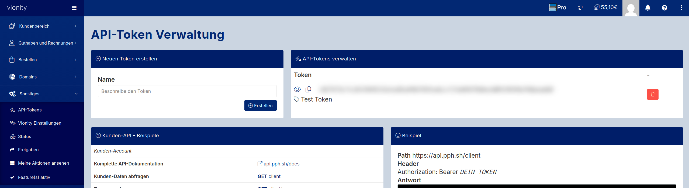

# pph for [`libdns`](https://github.com/libdns/libdns)

[](https://pkg.go.dev/github.com/libdns/pph)

This package implements the [libdns interfaces](https://github.com/libdns/libdns) for [PPH](https://www.prepaid-hoster.de/) using the [API](https://api.pph.sh), allowing you to manage DNS records.

## Authenticating

> [!IMPORTANT]
> This package supports API **token** authentication which is currently a beta feature of the provider.

Create an API Token in the Web-UI [Vionity.de](https://www.vionity.de/).

These tokens are not scoped, so be careful were you store this token.



## Example Configuration

You can either export the **token** by using an environment variable called `API_TOKEN` or the go initialization.

If you want to use the environment variable you need to pass an empty string `""` to the `pph.New("")` function.

You can also pass the **token** to the `pph.New("<I am a very secure token>")` function of the library.

```console
$ export API_TOKEN="<I am a very secure token>"
>
```

```golang
import (
  "context"

  "github.com/libdns/libdns"
  "github.com/libdns/pph"
)

func main() {
  zone := "zone.example.com"
  // uses the data from the API_TOKEN environment variable
  p := pph.New("")
  ctx := context.Background()
  records, err := p.GetRecords(ctx, zone)
}
```

Thie example uses the provider struct directly.

```golang
// With token Auth
p := pph.Provider{
    APIToken: "<I am a very secure token>",
}
```
